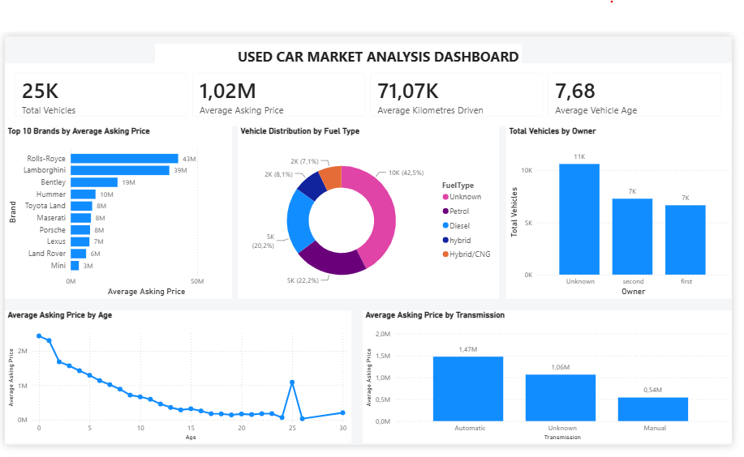

# Used Car Market Analysis – Power BI Dashboard

## Project Overview

This project presents an interactive Power BI dashboard developed to analyse the used car market and identify key patterns in vehicle pricing and characteristics.

The dashboard provides insights into vehicle prices, brands, age, mileage, fuel type, ownership and transmission.

## Dashboard Preview

## Key Performance Indicators

- **Total Vehicles:** 25K
- **Average Asking Price:** 1.02M
- **Average Kilometres Driven:** 71.07K
- **Average Vehicle Age:** 7.68 years

## Key Insights

- Rolls-Royce and Lamborghini have the highest average asking prices among the top 10 brands.
- Vehicle asking prices generally decrease as vehicle age increases.
- Automatic vehicles have a higher average asking price than manual vehicles.
- A significant proportion of vehicles have an unknown fuel type.
- The ownership data also contains a substantial number of vehicles classified as Unknown.
- The age analysis contains an unusual price increase around 25 years, which may require further investigation.

## Dashboard Visualisations

The dashboard includes:

- Top 10 Brands by Average Asking Price
- Vehicle Distribution by Fuel Type
- Total Vehicles by Owner
- Average Asking Price by Age
- Average Asking Price by Transmission
- KPI cards summarising the overall vehicle dataset

## Tools & Technologies

- **Power BI Desktop**
- **Power Query**
- **DAX**
- **Data Cleaning and Transformation**
- **Data Visualisation**
- **Exploratory Data Analysis**

## DAX Measures

Key measures created for the dashboard include:

- Total Vehicles
- Average Asking Price
- Average Kilometres Driven
- Average Vehicle Age

## Power BI File

The complete Power BI report is available in this repository:

`Used_Car_Market_Analysis_Dashboard.pbix`

Download the `.pbix` file and open it using Power BI Desktop to explore the dashboard.

## Related Machine Learning Project

This Power BI dashboard complements my Used Car Price Prediction machine learning project, where vehicle characteristics are used to predict used-car asking prices using Linear Regression and Random Forest Regression.
👉 [View the Used Car Price Prediction Machine Learning Project](https://github.com/lindokuhl146-ctrl/Used-Car-Price-Prediction)

## Author

**Lindokuhle Mathonsi**

Data Science Student | Data Analytics | Machine Learning | Power BI
